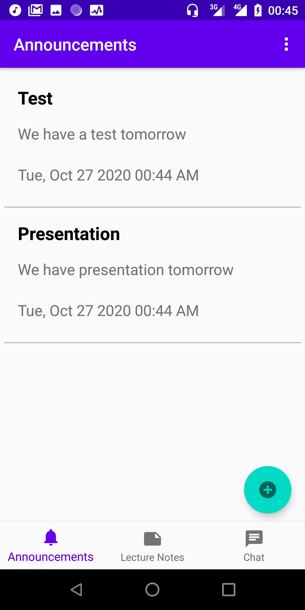
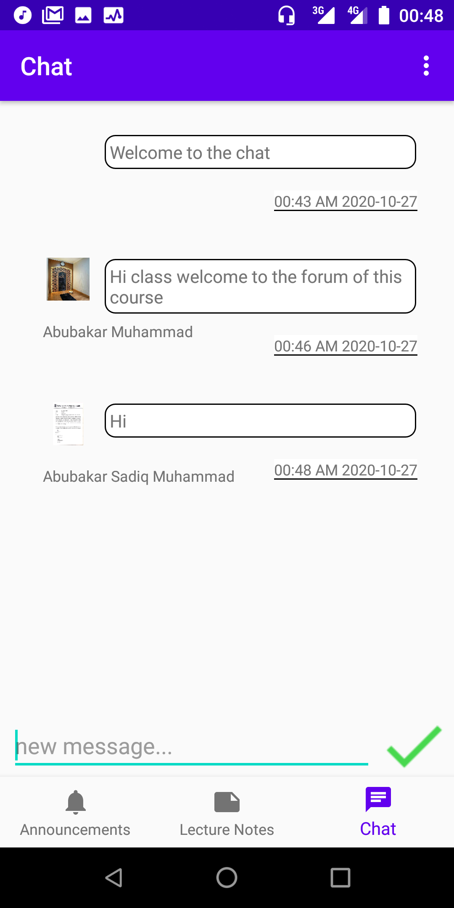

# Classroom
An android project that can enable tutors and students that allows the tutors to create courses room and for their students to enroll to these courses in order to make announcements, upload the subject study materials for the students to download and a chat section for all the students and the tutor of the courses to interact. The project has two separate modules that can be installed individually, the tutor app and the students app.

## Screenshots

The Student Sign-In Page

The Student Register Page

Students Enrolled Courses Page

Account Settings Page

Lecture Notes Page 

Announcements Page (Tutor's View)

Tutor's Courses Page 

Chat Page

